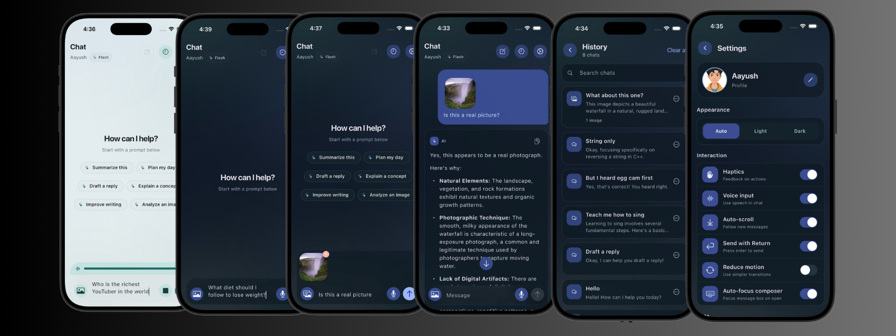

# AI Chatbot

A universal Flutter chat application powered by Google Gemini. It ships with
text and image understanding, voice dictation, persistent local chat history,
and a fully themeable interface — ready to rebrand and deploy on Android, iOS,
and the web.



## Features

- **Gemini chat** — Real-time conversations using the `gemini-2.5-flash` model.
- **Image understanding (vision)** — Attach photos from the gallery or camera
  and send them alongside your prompt to the multimodal model.
- **Voice input** — Dictate messages with live transcription and sound-level
  feedback, toggleable from Settings.
- **Chat history** — Every conversation is saved on-device. Search chats, swipe
  to delete one, or clear them all.
- **Flexible theming** — Auto / Light / Dark modes with custom themes,
  gradients, and motion-aware transitions.
- **Rich message rendering** — Assistant replies render Markdown, including
  code blocks.
- **Local user profile** — Set a display name and avatar; the first name shows
  in the chat header.
- **Deep settings** — Haptics, save-history, auto-scroll, voice input, reduce
  motion, send-with-Enter, composer auto-focus, and starter prompts.
- **Polished UX** — Floating composer, "jump to latest" button, animated
  confirmation dialogs, snackbars, and offline-safe local storage.

## Tech stack

| Layer | Choice |
| --- | --- |
| Framework | Flutter (Dart SDK `>=3.4.1 <4.0.0`) |
| AI | `google_generative_ai` (Gemini 2.5 Flash) |
| State management | `provider` (`ChangeNotifier`) |
| Local storage | `hive` + `hive_flutter` |
| Media | `image_picker`, `path_provider` |
| Voice | `speech_to_text` |
| Rendering | `flutter_markdown`, Material + Cupertino widgets |
| Config | `flutter_dotenv` / `String.fromEnvironment` |

## Prerequisites

- [Flutter SDK](https://docs.flutter.dev/get-started/install) (stable channel)
- Android Studio / Xcode toolchain for your target platform
- A **Google AI (Gemini) API key** — get one at
  [Google AI for Developers](https://ai.google.dev/)
- Android builds require **JDK 17** and **Android NDK `27.0.12077973`**

## Setup

1. **Install dependencies**

   ```bash
   flutter pub get
   ```

2. **Configure your API key** — pick one method:

   - **`.env` file (recommended for local development)**

     ```bash
     cp .env.example .env
     ```

     Then edit `.env`:

     ```env
     API_KEY=your_google_ai_api_key
     ```

     `GEMINI_API_KEY` and `GOOGLE_API_KEY` are also accepted.

   - **Dart define** (handy for CI and release builds)

     ```bash
     flutter run --dart-define=API_KEY=your_google_ai_api_key
     ```

   The `.env` file is optional at load time, so the app still builds without
   it — but you need a key to chat. The real key is gitignored.

3. **Run**

   ```bash
   flutter run
   ```

   If you previously built with an older toolchain, reset once:

   ```bash
   flutter clean
   flutter pub get
   ```

## Make it yours

This is a ready-to-rebrand template. To ship your own version:

1. **Rename the package** (optional) in `pubspec.yaml` (`name: chatbotapp`) and
   update the imports if you do.
2. **Change the app identifiers** from the generic `com.example.chatbotapp`:
   - Android: `namespace` and `applicationId` in `android/app/build.gradle`,
     plus the directory under `android/app/src/main/kotlin/`.
   - iOS: `PRODUCT_BUNDLE_IDENTIFIER` in
     `ios/Runner.xcodeproj/project.pbxproj`.
3. **Update the display name** in `android/app/src/main/AndroidManifest.xml`
   (`android:label`), `ios/Runner/Info.plist`, and `web/manifest.json`.
4. **Swap the icons** in `android/app/src/main/res/mipmap-*`,
   `ios/Runner/Assets.xcassets/AppIcon.appiconset/`, and `web/icons/`.

## Project structure

```
lib/
├── main.dart                  # App entry, providers, theme wiring
├── apis/api_service.dart      # API key resolution (dart-define / .env)
├── constants/constants.dart   # Models, box names, system prompt, prompts
├── hive/                      # Hive models + generated adapters
│   ├── boxes.dart, chat_history.dart, settings.dart, user_model.dart
├── models/message.dart        # Chat message model
├── providers/                 # ChangeNotifier state
│   ├── chat_provider.dart         # Gemini calls, history, image storage
│   ├── settings_provider.dart     # Theme + preferences
│   ├── user_profile_provider.dart # Local profile
│   └── voice_input_provider.dart  # Speech-to-text state
├── screens/                   # chat, history, settings, home
├── themes/my_theme.dart       # Light/dark themes
├── utilities/                 # Dialogs, snackbars, motion, assets, errors
└── widgets/                   # Reusable UI (chat/, composer, messages…)
```

## How it works

- On launch, `main.dart` loads `.env` (optional), initializes Hive, and mounts
  the providers.
- `ApiService` resolves the Gemini key from `--dart-define=API_KEY`, then
  `API_KEY` / `GEMINI_API_KEY` / `GOOGLE_API_KEY` in `.env`, and reports whether
  the app is configured.
- `ChatProvider` opens a Gemini chat session, streams the assistant reply,
  retries transient failures once, and persists messages, history, and copied
  chat images into Hive and the app documents directory.
- Images are copied into an app-owned `chat_media/<chatId>` folder so history
  keeps working even if the original picked file is removed.

## Android build notes

This project targets current Flutter / Android Studio installs:

| Component | Version |
| --- | --- |
| Gradle wrapper | `8.14` |
| Android Gradle Plugin | `8.11.1` |
| Kotlin | `2.2.20` |
| Java / Kotlin target | `17` |
| Android NDK | `27.0.12077973` (pinned) |

If you see errors about `gradle-7.6.3`, `Unsupported class file major version`,
or an NDK version mismatch, run `flutter clean` + `flutter pub get` and rebuild.
The NDK is explicitly pinned because a plugin requires a newer version than the
Flutter default.

## Testing

```bash
flutter test
flutter analyze
```

## Contributing

Contributions are welcome. Open an issue or submit a pull request with a clear
description and, where relevant, screenshots.

## License

Released under the [MIT License](./LICENSE).
