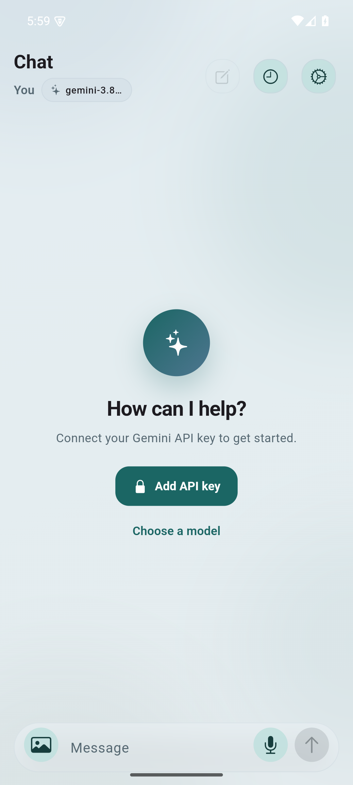
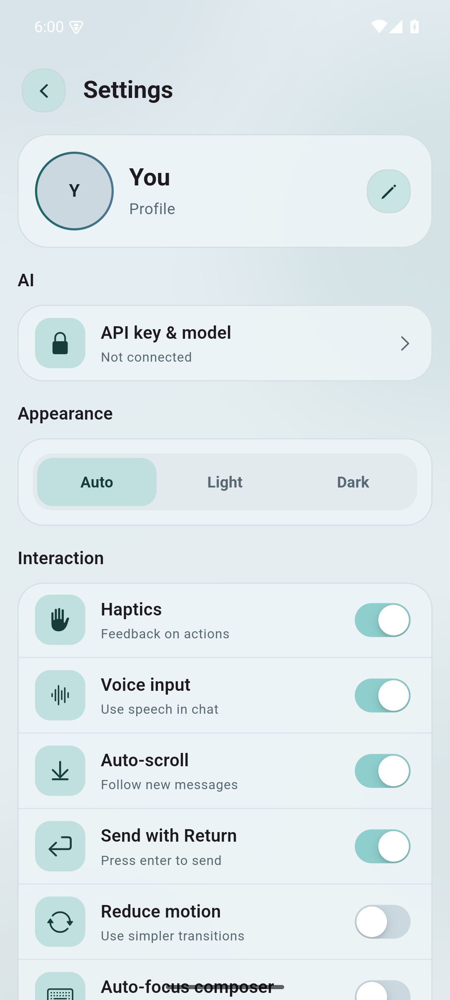
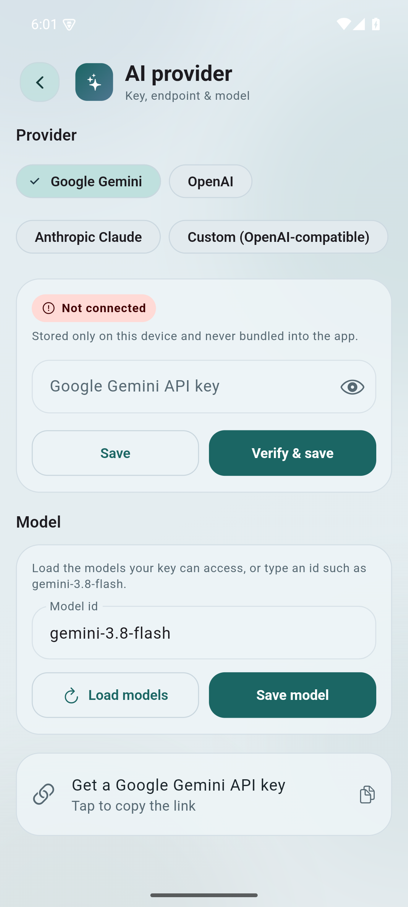
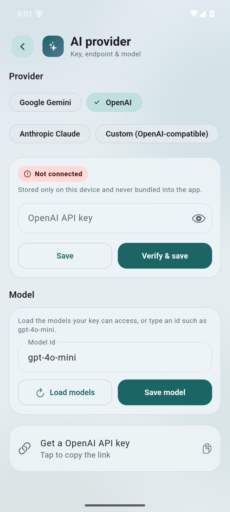

# AI Chatbot

A universal, multi-provider Flutter chat app. Bring your **own** API key and
pick your model — **Google Gemini**, **OpenAI**, **Anthropic Claude**, or any
**OpenAI-compatible** endpoint. Keys live only on the device and are never
bundled into the build.

Includes text and image understanding, voice dictation, persistent local chat
history, and a themeable, polished UI.

<p align="center">
  
  
  
  
</p>

## Features

- **Multi-provider** — Gemini, OpenAI, Anthropic Claude, and custom
  OpenAI-compatible base URLs (OpenRouter, Groq, local servers, …).
- **Bring your own key** — entered in-app, stored only on the device.
- **Configurable model** — load the models your key can access and pick one, or
  type any model id.
- **Gemini chat** — real-time conversations, with vision (image) input.
- **Voice input** — dictate messages with live transcription and sound-level
  feedback.
- **Chat history** — saved on-device; search chats, swipe to delete, or clear.
- **Flexible theming** — Auto / Light / Dark with custom themes and motion.
- **Rich rendering** — assistant replies render Markdown, including code blocks.
- **Local user profile** — display name and avatar persisted in app storage.

## Supported providers

| Provider | Adapter | Default model | Key |
| --- | --- | --- | --- |
| Google Gemini | `GeminiProvider` | `gemini-3.8-flash` | `AIza…` |
| OpenAI | `OpenAiProvider` | `gpt-4o-mini` | `sk-…` |
| Anthropic Claude | `AnthropicProvider` | `claude-3-5-sonnet-latest` | `sk-ant-…` |
| Custom (OpenAI-compatible) | `OpenAiProvider` + base URL | — | any |

Default model ids are just starting points — use **Load models** to fetch what
your key can access, then pick or type one.

## Tech stack

| Layer | Choice |
| --- | --- |
| Framework | Flutter (Dart SDK `>=3.4.1 <4.0.0`) |
| AI | Provider adapters over REST via `http` |
| State management | `provider` (`ChangeNotifier`) |
| Local storage | `hive` + `hive_flutter` |
| Media | `image_picker`, `path_provider` |
| Voice | `speech_to_text` |
| Rendering | `flutter_markdown`, Material + Cupertino widgets |

## Prerequisites

- [Flutter SDK](https://docs.flutter.dev/get-started/install) (stable channel)
- A key for at least one provider (e.g. free Gemini key at
  [Google AI Studio](https://aistudio.google.com/app/apikey))
- Android builds require **JDK 17** and **Android NDK `27.0.12077973`**

## Setup

1. **Install dependencies**

   ```bash
   flutter pub get
   ```

2. **Run** — no `.env` file and no build-time key are required:

   ```bash
   flutter run
   ```

3. **Connect in the app** — tap **Add API key** on the empty chat screen, or go
   to **Settings → AI → API key & model**:
   - pick a **provider**,
   - paste the key and tap **Verify & save** (for Custom, also set the base URL),
   - optionally tap **Load models** and choose a model.

### Optional: build-time keys (development / CI)

```bash
flutter run --dart-define=API_KEY=your_gemini_key
flutter run --dart-define=OPENAI_API_KEY=sk-...
flutter run --dart-define=ANTHROPIC_API_KEY=sk-ant-...
```

Keys entered in the app take precedence and are stored locally in Hive.

## Architecture

```
lib/apis/
├── ai_types.dart            # ChatTurn, InlineImage, AiException, AiProvider
├── ai_provider.dart         # Provider registry + factory
├── api_service.dart         # Per-provider key/model/base-URL storage (Hive)
├── http_errors.dart         # Shared HTTP → AiException mapping
└── providers/
    ├── gemini_provider.dart     # generativelanguage.googleapis.com
    ├── openai_provider.dart     # OpenAI + OpenAI-compatible
    └── anthropic_provider.dart  # api.anthropic.com
```

Each adapter implements [`AiProvider`] and maps the neutral `ChatTurn` list to
its own wire format:

- **Gemini** — `POST /v1beta/models/{model}:generateContent`, `x-goog-api-key`,
  `contents[]`/`parts[]`, `systemInstruction`, Gemini 3
  `generationConfig.thinkingConfig.thinkingLevel`.
- **OpenAI / custom** — `POST {baseUrl}/chat/completions`,
  `Authorization: Bearer`, `messages[]` (images as `image_url` data URLs).
- **Anthropic** — `POST /v1/messages`, `x-api-key` + `anthropic-version`,
  `system` + `messages[]` (images as base64 source blocks).

Model lists come from each provider's `GET /models` endpoint.

## Project structure

```
lib/
├── main.dart                      # App entry, providers, theme wiring
├── apis/                          # Provider adapters + local config
├── constants/constants.dart       # Box names, system prompt, prompts
├── hive/                          # Hive models + generated adapters
├── models/message.dart            # Chat message model
├── providers/
│   ├── ai_config_provider.dart    # Provider/key/model selection
│   ├── chat_provider.dart         # Requests, history, image storage
│   ├── settings_provider.dart     # Theme + preferences
│   ├── user_profile_provider.dart # Local profile (persists avatar)
│   └── voice_input_provider.dart  # Speech-to-text state
├── screens/                       # chat, history, settings, AI settings
├── themes/my_theme.dart           # Light/dark themes
├── utilities/                     # Dialogs, snackbars, motion, errors
└── widgets/                       # Reusable UI
```

## Make it yours

1. **Rename the package** (optional) in `pubspec.yaml` (`name: chatbotapp`).
2. **Change the app identifiers** from the generic `com.example.chatbotapp`:
   - Android: `namespace` / `applicationId` in `android/app/build.gradle` and the
     directory under `android/app/src/main/kotlin/`.
   - iOS: `PRODUCT_BUNDLE_IDENTIFIER` in
     `ios/Runner.xcodeproj/project.pbxproj`.
3. **Update the display name** in `android/app/src/main/AndroidManifest.xml`,
   `ios/Runner/Info.plist`, and `web/manifest.json`.
4. **Swap the icons** in the platform asset folders.

## Android build notes

| Component | Version |
| --- | --- |
| Gradle wrapper | `8.14` |
| Android Gradle Plugin | `8.11.1` |
| Kotlin | `2.2.20` |
| Java / Kotlin target | `17` |
| Android NDK | `27.0.12077973` (pinned) |

If you see errors about `gradle-7.6.3`, `Unsupported class file major version`,
or an NDK version mismatch, run `flutter clean` + `flutter pub get` and rebuild.

## Testing

```bash
flutter test
flutter analyze
```

## Notes & limitations

- The web target is scaffolded but currently blocked by `dart:io` usage in the
  storage/media code.
- Provider defaults (e.g. `gpt-4o-mini`) are hints; load models or type the id
  your account supports.

## Contributing

Contributions are welcome. Open an issue or submit a pull request with a clear
description and, where relevant, screenshots.

## License

Released under the [MIT License](./LICENSE).
